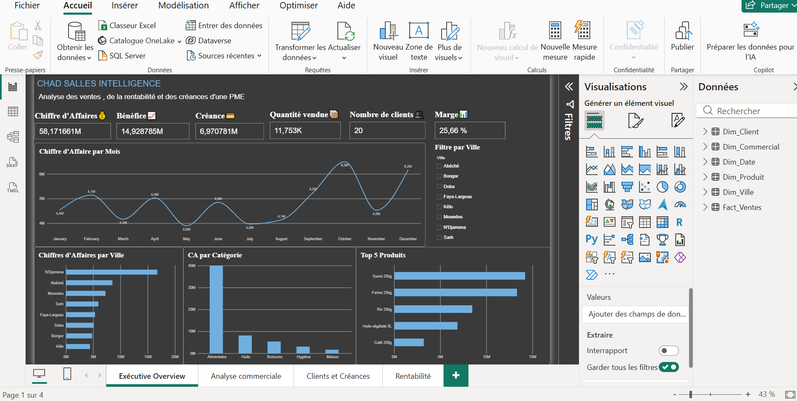
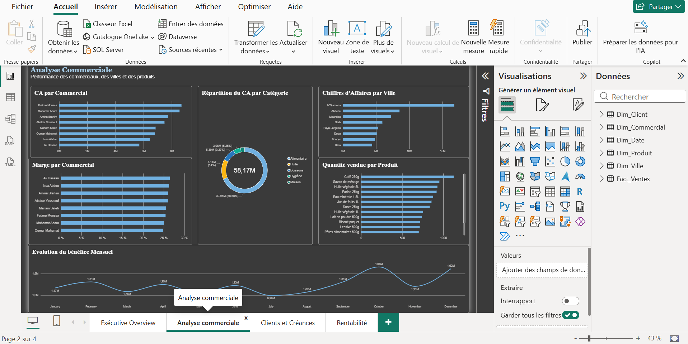
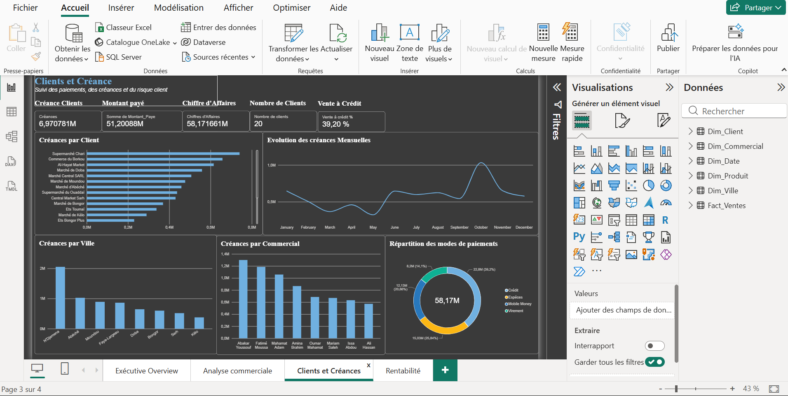
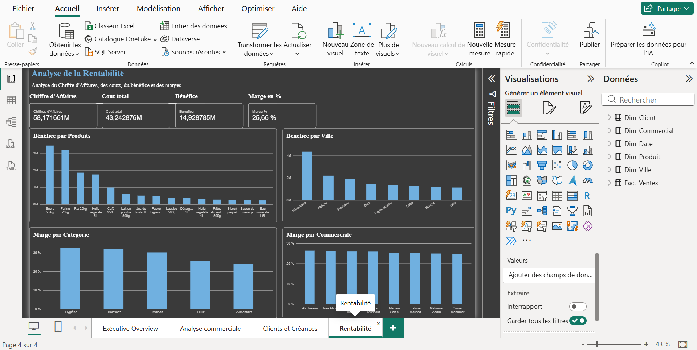

# 📊 CHAD SALES INTELLIGENCE

## Analyse des ventes, de la rentabilité et des créances d'une PME tchadienne

**CHAD SALES INTELLIGENCE** est un projet de Business Intelligence réalisé avec **Microsoft Power BI** autour d'une PME fictive tchadienne : **TCHAD DISTRIBUTION SARL**.

L'objectif du projet est de transformer des données commerciales en informations utiles à la prise de décision à travers l'analyse des ventes, de la rentabilité, des clients, des créances, des produits, des villes et des commerciaux.

> ⚠️ **Les données utilisées dans ce projet sont simulées à des fins pédagogiques et de portfolio. Elles ne représentent pas les données réelles d'une entreprise.**

---

## 🎯 Objectifs du projet

Le projet vise à :

- suivre le chiffre d'affaires ;
- analyser la rentabilité ;
- identifier les produits les plus performants ;
- comparer les performances des commerciaux ;
- analyser les performances par ville ;
- suivre les créances clients ;
- analyser les modes de paiement ;
- identifier les principaux insights commerciaux ;
- formuler des recommandations à partir des données.

---

# 🗂️ Données utilisées

Le modèle Power BI est construit autour d'une table de faits et de tables de dimensions.

### Table de faits

**Fact_Ventes**

Elle contient notamment :

- Vente_ID
- Date_ID
- Date
- Client_ID
- Produit_ID
- Commercial_ID
- Ville_ID
- Quantite
- Prix_Unitaire
- Montant_Vente
- Cout_Total
- Benefice
- Montant_Paye
- Creance
- Mode_Paiement

### Tables de dimensions

- **Dim_Date** — informations temporelles
- **Dim_Client** — informations sur les clients
- **Dim_Produit** — produits et catégories
- **Dim_Commercial** — commerciaux
- **Dim_Ville** — villes, provinces et zones

---

# 🛠️ Technologies utilisées

- **Microsoft Power BI**
- **Power Query**
- **DAX**
- **Modélisation de données**
- **Data Visualization**
- **Analyse de données**

---

# 🔄 Préparation et transformation des données

Les données ont été préparées dans **Power Query** avant leur utilisation dans le modèle Power BI.

Les principales étapes réalisées sont :

1. Importation des différentes tables.
2. Vérification et correction des en-têtes.
3. Correction des types de données.
4. Conversion des colonnes numériques.
5. Vérification des données.
6. Préparation des tables de dimensions.
7. Création des relations entre les tables.
8. Construction du modèle en étoile.

---

# ⭐ Modèle de données

Le modèle repose sur une architecture en étoile.

La table **Fact_Ventes** est reliée aux différentes dimensions :

```text
                    Dim_Date
                       │
                       │
Dim_Client ───── Fact_Ventes ───── Dim_Produit
                       │
                       │
                Dim_Commercial
                       │
                       │
                   Dim_Ville


## 📸 Aperçu du dashboard

### Executive Overview


### Analyse commerciale


### Clients & Créances


### Rentabilité

